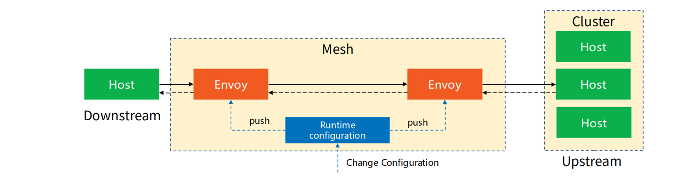

{}
监听器、路由、集群和端点是xDS的四个核心概念。
{}

## Envoy代理模式：请求转发

xDS的术语中定义了主机、上游、下游等概念，这些是envoy作为代理的基本工作模式：**请求转发**。即接收一个来自下游主机的请求，然后根据各种逻辑进行处理和决策，最后将请求转发给某个上游主机。

## 请求转发相关的xDS概念

| Concept  | 概念   | 描述                                                         |
| :------- | :----- | :----------------------------------------------------------- |
| Listener | 监听器 | 监听器是命名网地址（例如，端口、unix domain socket等)，可以被下游客户端连接。Envoy 暴露一个或者多个监听器给下游主机连接 |
| Router   | 路由   | 路由是一组将虚拟主机(virtual hosts)与群集(cluster)匹配的规则(rule)，允许您创建流量转移规则 |
| Cluster  | 集群   | 集群是指 Envoy 连接到的逻辑上相同的一组上游主机              |
| Endpoint | 端点   | Envoy将“端点(Endpoint)”定义为群集(Cluster)中可用的IP和端口   |

转发概念示意图如下：

### Listener

Listener：Envoy工作的基础
简单理解，Listener是Envoy打开的一个监听端口，用于接收来自Downstream（客户端）连接。Envoy可以支持复数个Listener。多个Listener之间几乎所有的配置都是隔离的。Listener配置中核心包括监听地址、Filter链等。

Listener对应的配置/资源发现服务称之为LDS。LDS是Envoy正常工作的基础，没有LDS，Envoy就不能实现端口监听（如果启动配置也没有提供静态Listener的话），其他所有xDS服务也失去了作用。

### Router

Router：上下游之间的桥梁
Listener可以接收来自下游的连接，Cluster可以将流量发送给具体的上游服务，而Router则决定Listener在接收到下游连接和数据之后，应该将数据交给哪一个Cluster处理。它定义了数据分发的规则。虽然说到Router大部分时候都可以默认理解为HTTP路由，但是Envoy支持多种协议，如Dubbo、Redis等，所以此处Router泛指所有用于桥接Listener和后端服务（不限定HTTP）的规则与资源集合。

Route对应的配置/资源发现服务称之为RDS。Router中最核心配置包含匹配规则和目标Cluster，此外，也可能包含重试、分流、限流等等。

### Cluster

Cluster：对上游服务的抽象
在Envoy中，每个Upstream上游服务都被抽象成一个Cluster。Cluster包含该服务的连接池、超时时间、endpoints地址、端口、类型（类型决定了Envoy获取该Cluster具体可以访问的endpoint方法）等等。

Cluster对应的配置/资源发现服务称之为CDS。一般情况下，CDS服务会将其发现的所有可访问服务全量推送给Envoy。与CDS紧密相关的另一种服务称之为EDS。CDS服务负责Cluster资源的推送。而当该Cluster类型为EDS时，说明该Cluster的所有endpoints需要由xDS服务下发，而不使用DNS等去解析。下发endpoints的服务就称之为EDS。

### Endpoint

## xDS和请求转发概念的对应关系

在Envoy v2 API中，RDS路由指向集群，CDS提供集群配置，通过EDS发现集群成员。

xDS API 示意图如下：

## 参考文档

- [Envoy-入门介绍与xDS协议](https://zhuanlan.zhihu.com/p/108846492)