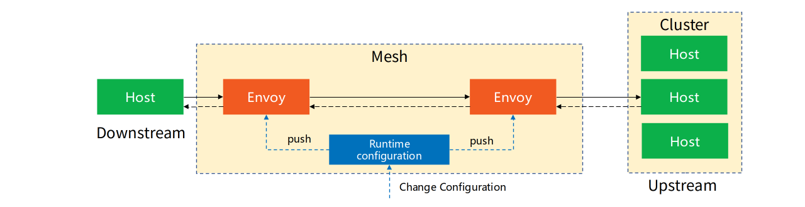

{}
在深入了解xDS之前，必须了解 xds 和 envoy 使用的术语。
{}

## 基本术语

### 官方文档

以下内容来自envoy官方文档:

https://www.envoyproxy.io/docs/envoy/latest/intro/arch_overview/intro/terminology

> A few definitions before we dive into the main architecture documentation. Some of the definitions are slightly contentious within the industry, however they are how Envoy uses them throughout the documentation and codebase, so *c’est la vie*.

在我们深入了解主要的架构文档之前，有几个定义。其中一些定义在行业内略有争议，但这些定义是Envoy在整个文档和代码库中的使用方式，所以这就是生活。

> **Host**: An entity capable of network communication (application on a mobile phone, server, etc.). In this documentation a host is a logical network application. A physical piece of hardware could possibly have multiple hosts running on it as long as each of them can be independently addressed.

**主机**: 一个能够进行网络通信的实体（手机上的应用程序、服务器等）。在本文档中，主机是逻辑网络应用。一个物理硬件上可能有多个主机在运行，只要它们能独立寻址。

> **Downstream**: A downstream host connects to Envoy, sends requests, and receives responses.

**下游**：下游主机连接到Envoy，发送请求并接收响应。

> **Upstream**: An upstream host receives connections and requests from Envoy and returns responses.

**上游**: 上游主机接收来自Envoy的连接和请求并返回响应。

> **Listener**: A listener is a named network location (e.g., port, unix domain socket, etc.) that can be connected to by downstream clients. Envoy exposes one or more listeners that downstream hosts connect to.

**监听器**: 监听器是命名的网络位置（例如：端口、unix domain socket等），可以被下游客户端连接。Envoy暴露一个或多个监听器，下游主机可以连接到这些监听器。

> **Cluster**: A cluster is a group of logically similar upstream hosts that Envoy connects to. Envoy discovers the members of a cluster via service discovery. It optionally determines the health of cluster members via active health checking. The cluster member that Envoy routes a request to is determined by the load balancing policy.

**集群**：集群是Envoy连接到的逻辑上相似的一组上游主机。Envoy通过服务发现来发现集群的成员。它可以选择通过主动健康检查来确定集群成员的健康状况。Envoy通过负载平衡策略决定将请求路由到某个集群成员。

> **Mesh**: A group of hosts that coordinate to provide a consistent network topology. In this documentation, an “Envoy mesh” is a group of Envoy proxies that form a message passing substrate for a distributed system comprised of many different services and application platforms.

**网格**：协调提供一致网络拓扑结构的一组主机。在本文档中，"Envoy mesh"是一组Envoy代理，它们构成了分布式系统的消息传递基础，这个分布式系统由很多不同服务和应用程序平台组成。

> **Runtime configuration**: Out of band realtime configuration system deployed alongside Envoy. Configuration settings can be altered that will affect operation without needing to restart Envoy or change the primary configuration.

**运行时配置**：外置实时配置系统，和 Envoy 一起部署。可以更改配置设置，影响操作，而无需重启 Envoy 或更改主要配置。

### 对术语的理解

下面这个图可以更好的帮助理解上述术语的概念和含义：

- 主机/上游/下游：请求由下游主机发起，envoy通过监听器接收到请求之后转发给上游主机
- 符合转发要求的上游主机可能有多个，这多个上游主机被称为"集群"，envoy通过负载均衡算法选择其中进行请求转发

## 其他术语

和xDS相关的其他概念还有：

| 概念              | 描述                                                         |
| :---------------- | :----------------------------------------------------------- |
| Management Server | 实现v2 Envoy API的逻辑服务器。 这不一定是单个物理机器，因为它可以被复制/分片， 并且用于不同xDS API的API服务可以在不同的物理机器上实现。 |

### 区域概念

| Concept  | 概念   | 描述                                                         |
| :------- | :----- | :----------------------------------------------------------- |
| Locality | 区域性 | Envoy实例或端点运行的位置。这包括地域/region，分区/zone和子分区/sub-zone标识。 |
| Region   | 地域   | 分区（zone）所在的地理区域。                                 |
| Zone     | 分区   | AWS中的Availability Zone (AZ), GCP中的Zone                   |
| Sub-zone | 子分区 | Envoy实例或端点在分区内运行的位置。这允许在分区内存在多个负载均衡目标。 |

### 术语的中文翻译

envoy和xds的术语在翻译中文时，为了保持一致，建议遵循envoy文档翻译小组的约定：

https://github.com/cloudnativeto/envoy/blob/zh/docs/root/term.md

## 参考文档

- https://www.envoyproxy.io/docs/envoy/latest/intro/arch_overview/intro/terminology
- https://www.servicemesher.com/envoy/intro/arch_overview/terminology.html：servicemesher社区翻译的envoy官方文档中文版本
- [Envoy v2 APIs for developers](https://github.com/envoyproxy/data-plane-api/blob/master/API_OVERVIEW.md): 在这里还补充有其他一些术语，但这个文章地址失效了，新版本中尚没有找到对应的内容。TODO：待查找。
