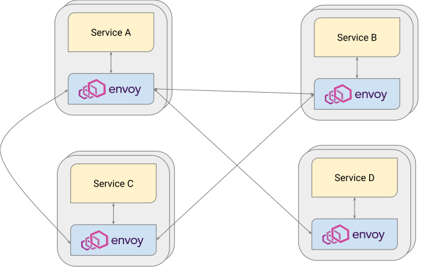
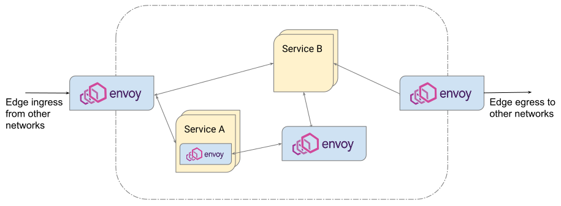
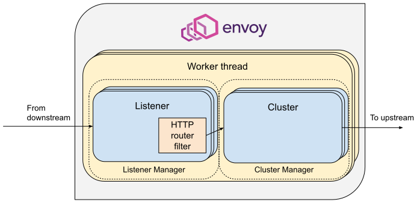
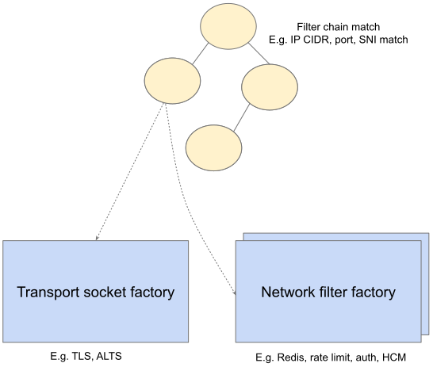
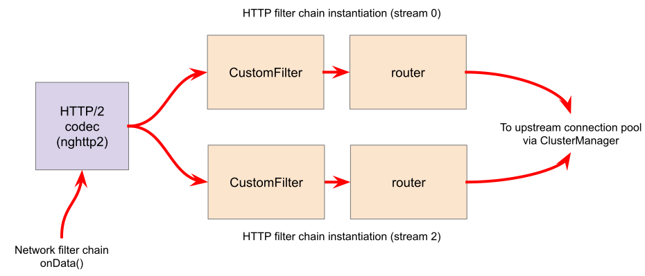
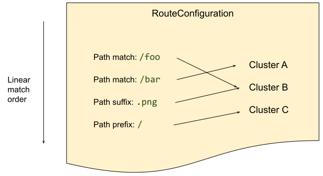
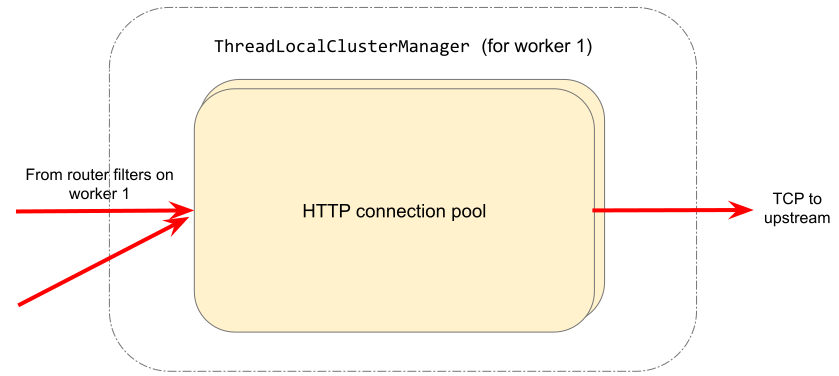
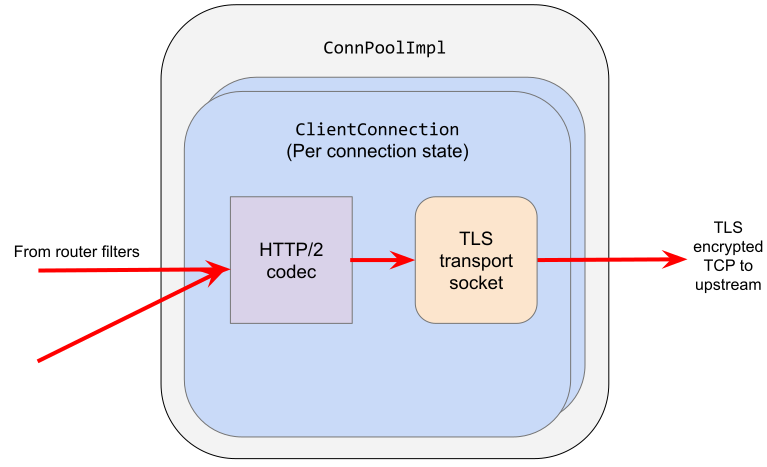

> 备注：内容翻译自envoy官方文档 [Life of a Request](https://www.envoyproxy.io/docs/envoy/latest/intro/life_of_a_request) 

下面，我们描述一个请求通过 Envoy 代理传递时，它生命周期中的事件。首先，我们描述 Envoy 如何适用于请求的请求路径， 然后描述在请求从下游到达 Envoy 代理之后发生的内部事件。 我们追踪该请求，直到相应的上游调度和响应路径为止。

## 术语

Envoy 在其代码库和文档中使用以下术语：

- *集群（Cluster）*: Envoy 将请求转发到的一组端点的逻辑服务。
- *下游（Downstream）*: 连接到 Envoy 的实体。可能是本地应用程序（使用 Sidecar 模型）或网络节点。在非 Sidecar 模型中，是一个远程客户端。
- *端点（Endpoints）*: 实现逻辑服务的网络节点。它们组成集群。集群中的端点就是 Envoy 代理的上游。
- *过滤器（Filter）*: 在连接或请求处理管道中提供某些方面请求处理的模块。就好比 Unix 是小型实用程序（过滤器）与 Unix 管道（过滤器链）的组合。
- *过滤器链（Filter chain）*: 一系列的过滤器。
- *监听器（Listeners）*: 负责绑定 IP/port、接受新的 TCP 链接（或者 UDP 数据包）以及管理面向请求处理的下游的模块。
- *上游（Upstream）*: 转发请求到一个服务时，Envoy 连接到的端点（网络节点）。可能是本地应用程序（使用 Sidecar 模型）或网络节点。在非 Sidecar 模型中，对应于远程后端。

## 网络拓扑结构

请求如何流经网络中的各个组件（包括 Envoy ）取决于网络的拓扑结构。Envoy 可用于多种网络拓扑中。 我们在下面重点介绍 Envoy 的内部操作，但在本节中我们将简要地介绍下 Envoy 与网络其余部分的关系。

Envoy 最初是作为 [服务网格](https://blog.envoyproxy.io/service-mesh-data-plane-vs-control-plane-2774e720f7fc) sidecar 代理， 从应用中分离了负载均衡、路由、可观察性、安全性和服务发现等功能。在服务网格模型中，请求流经 Envoy 作为网络的网关。 请求通过入口或出口监听器到达 Envoy：

- 入口（Ingress）监听器从服务网格中的其它节点获取请求，并将其转发到本地应用程序。本地应用程序的响应通过 Envoy 流回到下游。
- 出口（Engress）监听器从本地应用程序获取请求，并将其转发到网络中的其它节点。这些接收节点通常还将运行 Envoy 并通过其入口监听器接受请求。




Envoy 可用于服务网格之外的各种配置。例如它还可以充当内部负载均衡器：


或作为网络边缘上的入口/出口代理：


在实践当中，通常混合使用这些方法，Envoy 在服务网格中，它在边缘并且作为内部负载均衡器。一个请求路径可能会经过多个 Envoy。



Envoy 可以在多层拓扑中进行配置，以实现可伸缩性和可靠性，其中请求首先通过边缘 Envoy，然后再通过第二层 Envoy：


在上述所有情况下，请求将从下游通过 TCP，UDP 或 Unix 域套接字到达特定的 Envoy。 Envoy 将通过 TCP，UDP 或 Unix 域套接字向上游转发请求。我们在下面仅关注单个 Envoy 代理。

## 配置

Envoy是一个易于扩展的平台。这将导致可能的请求路径组合非常多，具体取决于：

- L3/4 协议，例如 TCP、UDP、Unix 域套接字。
- L7 协议，例如 HTTP/1、HTTP/2、HTTP/3、gRPC、Thrift、Dubbo、Kafka、Redis 和各种数据库。
- socket 传输，例如纯文本、TLS、ALTS。
- 连接路由，例如 PROXY 协议、原始目的地、动态转发。
- 认证和授权。
- 熔断机制和异常值检测配置以及激活状态。
- 网络、HTTP、监听器、访问日志、运行状况检查、跟踪和统计信息扩展的许多其他配置。

一次只专注于一个方面内容是很有效的，因此此示例涵盖以下内容：

- 通过TCP连接向下游和上游的LS发出的HTTP/2请求。
- HTTP连接管理器是唯一的网络过滤器。
- 假设的自定义过滤器和路由器过滤器作为HTTP过滤器链。
- 文件系统访问日志记录
- 统计下沉
- 具有静态端点的单个集群

为了简单起见，我们假定使用静态引导程序配置文件：

```yaml
static_resources:
  listeners:
  # There is a single listener bound to port 443.
  - name: listener_https
    address:
      socket_address:
        protocol: TCP
        address: 0.0.0.0
        port_value: 443
    # A single listener filter exists for TLS inspector.
    listener_filters:
    - name: "envoy.filters.listener.tls_inspector"
    # On the listener, there is a single filter chain that matches SNI for acme.com.
    filter_chains:
    - filter_chain_match:
        # This will match the SNI extracted by the TLS Inspector filter.
        server_names: ["acme.com"]
      # Downstream TLS configuration.
      transport_socket:
        name: envoy.transport_sockets.tls
        typed_config:
          "@type": type.googleapis.com/envoy.extensions.transport_sockets.tls.v3.DownstreamTlsContext
          common_tls_context:
            tls_certificates:
            - certificate_chain: {filename: "certs/servercert.pem"}
              private_key: {filename: "certs/serverkey.pem"}
      filters:
      # The HTTP connection manager is the only network filter.
      - name: envoy.filters.network.http_connection_manager
        typed_config:
          "@type": type.googleapis.com/envoy.extensions.filters.network.http_connection_manager.v3.HttpConnectionManager
          stat_prefix: ingress_http
          use_remote_address: true
          http2_protocol_options:
            max_concurrent_streams: 100
          # File system based access logging.
          access_log:
          - name: envoy.access_loggers.file
            typed_config:
              "@type": type.googleapis.com/envoy.extensions.access_loggers.file.v3.FileAccessLog
              path: "/var/log/envoy/access.log"
          # The route table, mapping /foo to some_service.
          route_config:
            name: local_route
            virtual_hosts:
            - name: local_service
              domains: ["acme.com"]
              routes:
              - match:
                  path: "/foo"
                route:
                  cluster: some_service
          # CustomFilter and the HTTP router filter are the HTTP filter chain.
          http_filters:
          # - name: some.customer.filter
          - name: envoy.filters.http.router
  clusters:
  - name: some_service
    # Upstream TLS configuration.
    transport_socket:
      name: envoy.transport_sockets.tls
      typed_config:
        "@type": type.googleapis.com/envoy.extensions.transport_sockets.tls.v3.UpstreamTlsContext
    load_assignment:
      cluster_name: some_service
      # Static endpoint assignment.
      endpoints:
      - lb_endpoints:
        - endpoint:
            address:
              socket_address:
                address: 10.1.2.10
                port_value: 10002
        - endpoint:
            address:
              socket_address:
                address: 10.1.2.11
                port_value: 10002
    typed_extension_protocol_options:
      envoy.extensions.upstreams.http.v3.HttpProtocolOptions:
        "@type": type.googleapis.com/envoy.extensions.upstreams.http.v3.HttpProtocolOptions
        explicit_http_config:
          http2_protocol_options:
            max_concurrent_streams: 100
  - name: some_statsd_sink
  # The rest of the configuration for statsd sink cluster.
# statsd sink.
stats_sinks:
- name: envoy.stat_sinks.statsd
  typed_config:
    "@type": type.googleapis.com/envoy.config.metrics.v3.StatsdSink
    tcp_cluster_name: some_statsd_sink
```

## 高层架构

Envoy 中的请求处理路径包括两个主要部分：

- 监听器子系统 对**下游**请求进行处理。它还负责管理下游请求生命周期以及到客户端的响应路径。下游 HTTP/2 编解码器位于此处。
- 集群子系统 负责选择和配置到端点的**上游**连接。这里可以了解集群和端点健康度，负载均衡和连接池存在情况。上游 HTTP/2 编解码器位于此处。

这两个子系统与 HTTP 路由过滤器桥接，该过滤器将 HTTP 请求从下游转发到上游。



我们使用上面的术语 [监听器子系统](https://www.envoyproxy.io/docs/envoy/latest/intro/arch_overview/listeners/listeners#arch-overview-listeners) 和 [集群子系统](https://www.envoyproxy.io/docs/envoy/latest/intro/arch_overview/upstream/cluster_manager#arch-overview-cluster-manager) 来指代由顶级 ListenerManager 和 ClusterManager 类创建的模块和实例类的组。这些管理系统在请求之前和请求的过程中会实例化许多我们在下面讨论的组件， 例如监听器、过滤器链、编解码器、连接池和负载均衡等数据结构。

Envoy 具有 [基于事件的线程模型](https://blog.envoyproxy.io/envoy-threading-model-a8d44b922310)。 主线程负责服务器的生命周期，配置处理，信息统计等。还有一些 [工作线程](https://www.envoyproxy.io/docs/envoy/latest/intro/arch_overview/intro/threading_model#arch-overview-threading) 负责请求处理。 所有线程都围绕事件循环（[libevent](https://libevent.org/)）运行，并且任何给定的下游 TCP 连接 （包括其上的所有多路复用流）都将由一个工作线程在其生命周期内完全处理。每个工作线程都维护自己的与上游端点的 TCP 连接池。 利用 SO_REUSEPORT 使内核始终将源/目标 IP:port 元组散列到同一工作线程进行 [UDP](https://cloudnative.to/envoy/intro/arch_overview/listeners/listeners.html#arch-overview-listeners-udp) 处理。 UDP 过滤器状态被给定的工作线程共享，使用该过滤器可以根据需要提供会话语义。这与我们下面讨论的面向连接的 TCP 过滤器不同， 在 TCP 过滤器中，每个连接均存在过滤器状态，而对于 HTTP 过滤器，则是基于请求进行过滤。

工作线程很少共享状态，并以琐碎的并行方式运行。这种线程模型能够扩展到非常高核心数的CPU。

## 请求流程

### 概况

使用上面的示例配置简要概述请求和响应的生命周期：

1. 在 工作线程 上运行的 Envoy 监听器 接受来自下游的 TCP 连接。

2. 监听过滤器 链被创建并运行后。 它可以提供 SNI 和 pre-TLS 信息。一旦完成后， 监听器将匹配网络过滤器链。每个监听器可能具有多个过滤器链，这些过滤器链是在目标 IP CIDR 范围、SNI、ALPN、源端口等的某种组合上匹配。 传输套接字（在我们的情况下为 TLS 传输套接字）与此过滤器链相关联。

3. 在进行网络读取时， TLS 传输套接字将从 TCP 连接读取的数据解密为解密的数据流，以进行进一步处理。

4. 网络过滤器 链已创建并运行。HTTP 最重要的过滤器是 HTTP 连接管理器，它是链中的最后一个网络过滤器。

5. HTTP 连接管理器 中的 HTTP/2 编解码器将解密后的数据流从 TLS 连接解帧并解复用为多个独立的流。每个流只处理一个请求和响应。

6. 对于每个 HTTP 请求流，都会创建并运行 HTTP 过滤器 链。该请求首先通过可以读取和修改请求的自定义过滤器。 路由过滤器是最重要的 HTTP 过滤器，它位于 HTTP 过滤器链的末尾。在路由过滤器上调用 decodeHeaders 时，将选择路由和集群。数据流上的请求 头被转发到该集群中的上游端点。 路由 过滤器通过从集群管理器中匹配到的集群获取HTTP连接池，以执行操作。

7. 执行集群特定的 负载均衡 以查找端点。通过检查集群的断路器，以确定是否允许新的数据流。如果端点的连接池 为空或容量不足，则会创建到端点的新连接。

8. 上游端点连接的 HTTP/2 编解码器将请求流与通过单个 TCP 连接流向上游的任何其他流进行多路复用和帧化。

9. 上游端点连接的 TLS 传输套接字对这些字节进行加密，并将其写入上游连接的 TCP 套接字。

10. 由请求头，可选的请求体和尾部组成的请求在上游被代理，而响应在下游被代理。响应以与请求 逆序 通过 HTTP 过滤器， 从路由器过滤器开始并通过自定义过滤器，然后再发送到下游。

11. 当响应完成后，请求流将被销毁。请求后，处理程序将更新统计信息，写入访问日志并最终确定追踪 span。

我们将在以下各节中详细介绍每个步骤。

### 1. 监听器接入 TCP


*ListenerManager* 负责获取描述 [监听器](https://www.envoyproxy.io/docs/envoy/latest/intro/arch_overview/listeners/listeners#arch-overview-listeners) 的配置，然后实例化多个监听器实例，并绑定到其各自的 IP/ports。监听器可能处于以下三种状态之一：

- *Warming*: 监听器正在等待配置依赖项（例如路由配置、动态密钥）。监听器尚未准备好接受 TCP 连接。
- *Active*: 监听器绑定到其 IP/port 并接受 TCP 连接。
- *Draining*: 监听器不再接受新的 TCP 连接，只允许现有的 TCP 连接在排空（draining）期内继续运行。

每个 [工作线程](https://cloudnative.to/envoy/intro/arch_overview/intro/threading_model.html#arch-overview-threading) 为每个已配置的监听器维护自己的*监听器*实例。每个监听器都可以通过 SO_REUSEPORT 绑定到同一端口， 或者共享一个绑定到该端口的套接字。当新的 TCP 连接到达时，内核决定哪个工作线程将接受该连接，并且该工作线程的监听器将对 `Server::ConnectionHandlerImpl::ActiveTcpListener::onAccept()` 进行回调。

### 2. 监听过滤器链和网络过滤器链匹配

工作线程的监听器将创建并运行 [监听过滤器](https://cloudnative.to/envoy/intro/arch_overview/listeners/listener_filters.html#arch-overview-listener-filters) 链。过滤器链是通过应用每个过滤器的*过滤器工厂*而创建的。 过滤器工厂知道过滤器的配置，并为每个连接或流创建一个新的过滤器实例。

对于我们的 TLS 监听器配置，监听过滤器链由 [TLS 检查](https://cloudnative.to/envoy/configuration/listeners/listener_filters/tls_inspector.html#config-listener-filters-tls-inspector) （`envoy.filters.listener.tls_inspector`）过滤器组成。 该过滤器检查初始 TLS 握手并提取服务器名称（SNI）。然后使用 SNI 进行过滤器链匹配。同时，TLS 检查器明确显示在监听过滤器链配置中，每当监听器的过滤器链中需要 SNI（或 ALPN ） Envoy 还可以自动插入。


TLS 检查过滤器实现 [ListenerFilter](https://github.com/envoyproxy/envoy/blob/9ff59124bd5e494acf3667c5ebe441fe5981a783/include/envoy/network/filter.h) 接口。所有过滤器接口，无论是监听器还是网络层/HTTP 层，都要求过滤器实现特定连接或流事件的回调。 在有 ListenerFilter 的情况下为：

```c++
virtual FilterStatus onAccept(ListenerFilterCallbacks& cb) PURE;
```

`onAccept()` 允许 filter 在 TCP 接受处理期间运行。通过回调返回的 `FilterStatus` 来控制监听过滤链将如何继续工作。监听过滤器可以暂停过滤器链，然后稍后恢复， 例如：响应对另一个服务进行的 RPC。

从监听过滤器和连接属性中提取的信息用于匹配过滤器链，从而提供网络过滤器链和将用于处理连接的传输套接字。



### 3. TLS 传输套接字解密

Envoy 通过 [TransportSocket](https://github.com/envoyproxy/envoy/blob/9ff59124bd5e494acf3667c5ebe441fe5981a783/include/envoy/network/transport_socket.h) 扩展接口提供可插拔的传输套接字。传输套接字遵循 TCP 连接的生命周期事件， 并读写网络缓冲区。传输套接字必须实现的一些关键方法有：

```c++
virtual void onConnected() PURE;
virtual IoResult doRead(Buffer::Instance& buffer) PURE;
virtual IoResult doWrite(Buffer::Instance& buffer, bool end_stream) PURE;
virtual void closeSocket(Network::ConnectionEvent event) PURE;
```

当 TCP 连接上有可用数据时， `Network::ConnectionImpl::onReadReady()` 通过 `SslSocket::doRead()` 调用 [TLS](https://cloudnative.to/envoy/intro/arch_overview/security/ssl.html#arch-overview-ssl) 传输套接字。 之后，传输套接字在 TCP 连接上执行 TLS 握手。完成握手后，`SslSocket::doRead()` 将解密的字节流提供给 `Network::FilterManagerImpl` 负责管理网络过滤器链的实例。


需要特别注意的是，无论是 TLS 握手还是过滤器管道暂停，任何操作都无法真正阻塞。 由于 Envoy 是基于事件的，因此任何需要额外数据处理的情况都会导致事件提前完成， 并使 CPU 产生另一个事件。当网络使更多数据可供读取时，读取事件将触发 TLS 握手的恢复。

### 4. 网络过滤器链处理

与监听滤器链一样，Envoy 将通过 Network::FilterManagerImpl 实例化其过滤器工厂中的一系列 [网络过滤器](https://cloudnative.to/envoy/intro/arch_overview/listeners/network_filters.html#arch-overview-network-filters)。 该实例对于每个新连接都是新的。网络过滤器（如传输套接字）跟随 TCP 生命周期事件，并作为可以从传输套接字使用的数据被调用。


网络过滤器组成管道，与每次连接一个的传输套接字不同。 网络过滤器分为三种：

- [ReadFilter](https://github.com/envoyproxy/envoy/blob/9ff59124bd5e494acf3667c5ebe441fe5981a783/include/envoy/network/filter.h) 实现 `onData()`，当连接中有数据可用时而调用（由于某些请求）。
- [WriteFilter](https://github.com/envoyproxy/envoy/blob/9ff59124bd5e494acf3667c5ebe441fe5981a783/include/envoy/network/filter.h) 实现 `onWrite()`，在即将将数据写入连接时调用（由于某些响应）。
- [Filter](https://github.com/envoyproxy/envoy/blob/9ff59124bd5e494acf3667c5ebe441fe5981a783/include/envoy/network/filter.h) 同时实现 *ReadFilter* 和 *WriteFilter*。

主要的过滤器方法的方法签名为：

```
virtual FilterStatus onNewConnection() PURE;
virtual FilterStatus onData(Buffer::Instance& data, bool end_stream) PURE;
virtual FilterStatus onWrite(Buffer::Instance& data, bool end_stream) PURE;
```

与监听过滤器一样， `FilterStatus` 允许过滤器暂停执行过滤器链。例如，如果需要查询限速服务，则限速网络过滤器将从 `onData()` 返回 `Network::FilterStatus::StopIteration`，然后在查询完成时调用 `continueReading()`。

用于处理 HTTP 的监听器的最后一个网络过滤器是 [HTTP connection manager](https://www.envoyproxy.io/docs/envoy/latest/intro/arch_overview/http/http_connection_management#arch-overview-http-conn-man) （HCM）。它负责创建 HTTP/2 编解码器并管理HTTP筛选器链。 在我们的示例中，这是唯一的网络过滤器。 使用多个网络过滤器的示例网络过滤器链如下所示：


在响应路径上，以与请求路径相反的顺序执行网络过滤器链。


### 5. HTTP/2 编解码器解码

Envoy 中的 HTTP/2 编解码器基于 [nghttp2](https://nghttp2.org/)。HCM 用 TCP 连接中的纯文本字节调用它（在网络过滤器链转换之后）。 编解码器将字节流解码为一系列 HTTP/2 帧，并将连接解复用为多个独立的 HTTP 流。流多路复用是 HTTP/2 中的一项关键功能，与 HTTP/1 相比，它具有显着的性能优势。 每个 HTTP 流都处理单个请求和响应。

编码解码器还负责处理 HTTP/2 帧设置、流和连接级别的 [流量控制](https://github.com/envoyproxy/envoy/blob/9ff59124bd5e494acf3667c5ebe441fe5981a783/source/docs/flow_control.md)。

编解码器负责抽象 HTTP 连接的细节，向 HTTP 连接管理器提供标准视图，并将连接的 HTTP 过滤器链拆分为多个流，每个流均带有请求/响应标头/正文/尾部。 无论协议是 HTTP/1、HTTP/2 还是 HTTP/3 都是如此。

### 6. HTTP 过滤器链处理

对于每个 HTTP 流，HCM 都按照上面为监听器和网络过滤器链建立的模式实例化 [HTTP 过滤器](https://cloudnative.to/envoy/intro/arch_overview/http/http_filters.html#arch-overview-http-filters) 链。

](https://cloudnative.to/envoy/_images/lor-http-filters.svg)

HTTP 过滤器接口共有三种：

- [StreamDecoderFilter](https://github.com/envoyproxy/envoy/blob/9ff59124bd5e494acf3667c5ebe441fe5981a783/include/envoy/http/filter.h) 带有用于处理请求的回调。
- [StreamEncoderFilter](https://github.com/envoyproxy/envoy/blob/9ff59124bd5e494acf3667c5ebe441fe5981a783/include/envoy/http/filter.h) 带有用于响应处理的回调。
- [StreamFilter](https://github.com/envoyproxy/envoy/blob/9ff59124bd5e494acf3667c5ebe441fe5981a783/include/envoy/http/filter.h) 同时实现 StreamDecoderFilter 和 StreamEncoderFilter。

查看解码器过滤器接口：

```c++
virtual FilterHeadersStatus decodeHeaders(RequestHeaderMap& headers, bool end_stream) PURE;
virtual FilterDataStatus decodeData(Buffer::Instance& data, bool end_stream) PURE;
virtual FilterTrailersStatus decodeTrailers(RequestTrailerMap& trailers) PURE;
```

HTTP 过滤器遵循 HTTP 请求的生命周期，而不是对连接缓冲区和事件进行操作，例如 `decodeHeaders()` 将 HTTP 请求头作为参数而不是字节缓冲区。 与网络和监听器过滤器一样，返回的 `FilterStatus` 提供了管理过滤器链控制流的功能。

当 HTTP/2 编解码器使 HTTP 请求头可用时，它们首先被传递到自定义过滤器中的 `decodeHeaders()`。如果返回的 `FilterHeadersStatus` 为 `Continue`， 然后 HCM 将请求头（可能由自定义过滤器导致）传递到路由器过滤器。

解码器和编/解码器过滤器在请求路径上执行。编码器和编/解码器过滤器在响应路径上以 [相反的方向](https://cloudnative.to/envoy/intro/arch_overview/http/http_filters.html#arch-overview-http-filters-ordering) 执行。 思考以下示例过滤器链：


请求路径如下所示：


响应路径如下所示：


当在 [路由器](https://cloudnative.to/envoy/intro/arch_overview/http/http_routing.html#arch-overview-http-routing) 过滤器上调用 `decodeHeaders()` 时，将完成路由选择并选择一个集群（cluster）。HCM 在 HTTP 过滤器链 执行开始时从其 `RouteConfiguration` 中选择一条路由。这称为缓存路由。过滤器可以通过要求 HCM 清除*路由缓存*并请求 HCM 重新评估路由选择来修改标头致使选择新路由。 调用路由器过滤器时，路由将最终确定。所选路由的配置将指向上游集群名称。 然后路由器过滤器向 ClusterManager 询问群集的 [connection pool](https://cloudnative.to/envoy/intro/arch_overview/upstream/connection_pooling.html#arch-overview-conn-pool)。这涉及负载均衡和连接池，将在下一节中讨论。



生成的 HTTP 连接池用于在路由器中构建 UpstreamRequest 对象，该对象封装了上游 HTTP 请求的 HTTP 编码和解码回调方法。一旦在 HTTP 连接池中的连接上分配了流， 就可以通过调用 `UpstreamRequest::encoderHeaders()` 将请求标头转发到上游端点。

路由器过滤器负责从 HTTP 连接池分配的流上的上游请求生命周期管理的所有方面。它还负责请求超时，重试和关联。

### 7. 负载均衡

每个集群都有一个 [负载均衡器](https://cloudnative.to/envoy/intro/arch_overview/upstream/load_balancing/overview.html#arch-overview-load-balancing) ，当新请求到达时，该负载均衡器会选择一个端点。Envoy 支持多种负载均衡算法，例如加权轮循（weighted round-robin）、磁悬浮（Maglev）、最小负荷（least-loaded）、随机（random）。负载均衡器从静态引导程序配置、DNS、动态 xDS（CDS 和 EDS 发现服务）以及主动/被动运行状况检查的组合中获得有效分配。[负载均衡文档](https://cloudnative.to/envoy/intro/arch_overview/upstream/load_balancing/overview.html#arch-overview-load-balancing) 中提供了有关 Envoy 中负载均衡的工作方式的更多详细信息。

选择端点后，将使用该端点的 [连接池](https://cloudnative.to/envoy/intro/arch_overview/upstream/connection_pooling.html#arch-overview-conn-pool) 来查找用于转发请求的连接。如果不存在与主机的连接，或者所有连接都处于其最大并发流限制， 则除非触发连接最大集群的熔断机制，否则将建立新连接并将其放置在连接池中。如果配置并达到了连接的最大生存期流限制，则会在池中分配一个新的连接，并且等待 HTTP/2 连接结束。 其他的熔断机制，例如检查对集群的最大并发请求。有关更多详细信息请参见 [熔断机制](https://github.com/envoyproxy/envoy/blob/9ff59124bd5e494acf3667c5ebe441fe5981a783/arch_overview_circuit_breakers) 和 [连接池](https://cloudnative.to/envoy/intro/arch_overview/upstream/connection_pooling.html#arch-overview-conn-pool)。



### 8. HTTP/2 编解码器编码

所选连接的 HTTP/2 编解码器将请求流与通过单个 TCP 连接流向同一上游的任何其他流进行多路复用。这与 [HTTP/2 编解码器解码](https://cloudnative.to/envoy/intro/life_of_a_request.html#life-of-a-request-http2-decoding) 相反。

与下游 HTTP/2 编解码器一样，上游编解码器负责获取 Envoy 对 HTTP 的标准抽象，即多个流在单个连接上与请求/响应标头/正文/尾部复用，通过生成一系列 HTTP/2 帧来将其映射到指定的 HTTP/2 。

### 9. TLS 传输套接字加密

上游端点连接的 TLS 传输套接字对 HTTP/2 编解码器输出中的字节进行加密，并将其写入用于上游连接的 TCP 套接字。与 TLS 传输套接字解密一样，在我们的示例中，集群配置了提供 TLS 传输安全性的传输套接字。上游和下游传输套接字扩展存在相同的接口。



### 10. 响应路径和 HTTP 生命周期

由请求头、可选的正文和尾部组成的请求在上游被代理，响应在下游被代理。响应以与请求 [逆序](https://cloudnative.to/envoy/intro/arch_overview/http/http_filters.html#arch-overview-http-filters-ordering) 通过HTTP和网络过滤器。

解码器/编码器请求生命周期事件的各种回调将在 HTTP 过滤器中调用，例如当响应片尾被转发或请求主体被流式传输时。 同样，当请求期间数据继续在两个方向上流动时， 读/写网络过滤器也将调用其各自的回调。 Various callbacks for decoder/encoder request lifecycle events will be invoked in HTTP filters, e.g. when response trailers are being forwarded or the request body is streamed. Similarly, read/write network filters will also have their respective callbacks invoked as data continues to flow in both directions during a request.

端点的 [异常检测](https://cloudnative.to/envoy/intro/arch_overview/upstream/outlier.html#arch-overview-outlier-detection) 状态会随着请求的进行而修改。

当上游响应到达其流的末尾时，即当接收到带有尾流的片尾或响应头/主体时，表示请求完成。这在 `Router::Filter::onUpstreamComplete()` 中处理。

请求有可能提前终止。这可能是由于（但不限于）：

- 请求超时。
- 上游端点流重置。
- HTTP筛选器流重置。
- 熔断机制。
- 上游资源不可用，例如缺少路由集群。
- 没有健康的端点。
- DoS 保护。
- HTTP 协议违规。
- 来自 HCM 或 HTTP 过滤器的本地回复。例如速率限制 HTTP 过滤器返回429响应。

如果发生这些情况中的任何一种，Envoy 可能会发送内部生成的响应（如果尚未发送上游响应头），或者将流重置（如果响应头已经转发至下游）。Envoy [调试常见问题 解答](https://cloudnative.to/envoy/faq/overview.html#faq-overview-debug) 提供了有关解释这些早期流终止的更多信息。

### 11. 请求后处理过程

请求完成后，流将被销毁。还会发生以下情况：

- 请求后 [统计信息](https://cloudnative.to/envoy/intro/arch_overview/observability/statistics.html#arch-overview-statistics) 将进行更新（例如计时、活动请求、升级、运行状况检查）。但是在请求处理期间，某些统计信息会更早更新。 此时， 统计信息尚未写入统计 [信息接收器](https://cloudnative.to/envoy/api-v3/config/bootstrap/v3/bootstrap.proto.html#envoy-v3-api-field-config-bootstrap-v3-bootstrap-stats-sinks)，而是由主线程定期进行批处理和写入。在我们的示例中， 这是一个统计信接收器。
- [访问日志](https://cloudnative.to/envoy/intro/arch_overview/observability/access_logging.html#arch-overview-access-logs) 将写入访问日志 [接收器](https://cloudnative.to/envoy/intro/arch_overview/observability/access_logging.html#arch-overview-access-logs-sinks)。 在我们的示例中，这是一个文件访问日志。
- [追踪](https://cloudnative.to/envoy/intro/arch_overview/observability/tracing.html#arch-overview-tracing) span 已完成。如果跟踪了我们的示例请求，则描述请求的持续时间和详细信息的跟踪范围将由 HCM 在处理请求标头时创建，然后由 HCM 在请求后处理期间最终确定。
