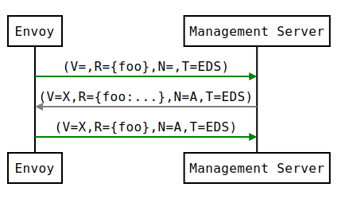
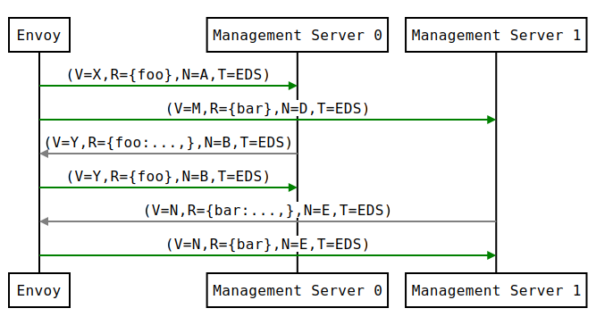
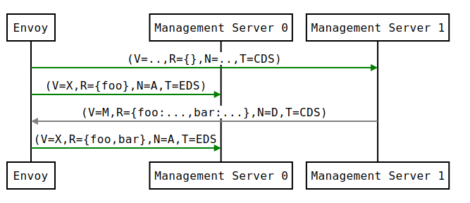
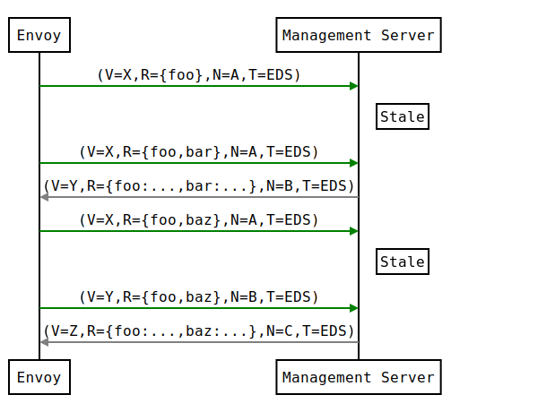
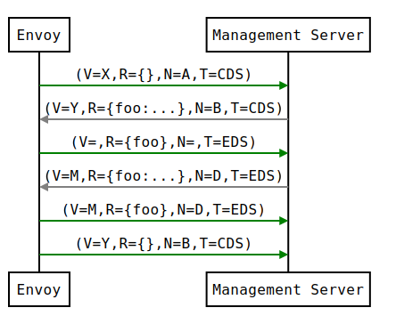
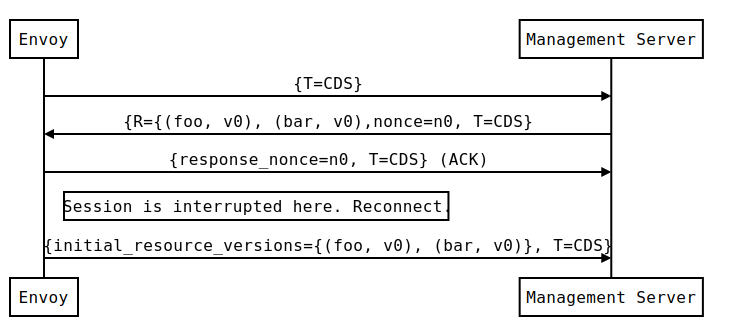

> 备注：内容来自 [xDS REST and gRPC protocol](https://www.envoyproxy.io/docs/envoy/latest/api-docs/xds_protocol)

Envoy通过文件系统或通过查询一个或多个管理服务器来发现其各种动态资源。这些发现服务及其相应的API统称为xDS。 通过订阅，指定要监视的文件系统路径，启动gRPC流或轮询REST-JSON URL来请求资源。后两种方法涉及使用DiscoveryRequest proto 载荷发送请求。在所有方法中资源以DiscoveryResponse proto 负载的形式发送。我们在下面讨论每种类型的订阅。

## 资源类型

xDS API中的每个配置资源都有关联的类型。资源类型遵循版本方案。资源类型是独立于下面描述的传输方式的版本。

支持以下 v3 xDS 资源类型：

- [envoy.config.listener.v3.Listener](https://www.envoyproxy.io/docs/envoy/latest/api-v3/config/listener/v3/listener.proto#envoy-v3-api-msg-config-listener-v3-listener)
- [envoy.config.route.v3.RouteConfiguration](https://www.envoyproxy.io/docs/envoy/latest/api-v3/config/route/v3/route.proto#envoy-v3-api-msg-config-route-v3-routeconfiguration)
- [envoy.config.route.v3.ScopedRouteConfiguration](https://www.envoyproxy.io/docs/envoy/latest/api-v3/config/route/v3/scoped_route.proto#envoy-v3-api-msg-config-route-v3-scopedrouteconfiguration)
- [envoy.config.route.v3.VirtualHost](https://www.envoyproxy.io/docs/envoy/latest/api-v3/config/route/v3/route_components.proto#envoy-v3-api-msg-config-route-v3-virtualhost)
- [envoy.config.cluster.v3.Cluster](https://www.envoyproxy.io/docs/envoy/latest/api-v3/config/cluster/v3/cluster.proto#envoy-v3-api-msg-config-cluster-v3-cluster)
- [envoy.config.endpoint.v3.ClusterLoadAssignment](https://www.envoyproxy.io/docs/envoy/latest/api-v3/config/endpoint/v3/endpoint.proto#envoy-v3-api-msg-config-endpoint-v3-clusterloadassignment)
- [envoy.extensions.transport_sockets.tls.v3.Secret](https://www.envoyproxy.io/docs/envoy/latest/api-v3/extensions/transport_sockets/tls/v3/secret.proto#envoy-v3-api-msg-extensions-transport-sockets-tls-v3-secret)
- [envoy.service.runtime.v3.Runtime](https://www.envoyproxy.io/docs/envoy/latest/api-v3/service/runtime/v3/rtds.proto#envoy-v3-api-msg-service-runtime-v3-runtime)

类型URL的概念出现在下面，其形式为type.googleapis.com/<资源类型>--例如，type.googleapis.com/envoy.config.cluster.v3.Cluster为一个Cluster资源。在Envoy的各种请求和管理服务器的响应中，都会说明资源类型URL。

## 文件系统订阅

提供动态配置的最简单方法是将其放置在 [ConfigSource](https://www.envoyproxy.io/docs/envoy/latest/api-v2/api/v2/core/config_source.proto#core-configsource) 中指定的众所周知的路径中。Envoy将使用`inotify`（Mac OS X上的kqueue）来监视文件的更改，并在更新时解析文件中的`DiscoveryResponse` proto。二进制protobufs，JSON，YAML和proto文本是`DiscoveryResponse`支持的格式。

除了统计计数器和日志以外，没有任何机制可用于文件系统订阅ACK/NACK更新。如果发生配置更新拒绝，xDS API的最后一个有效配置将继续适用。

## 流式gRPC订阅

### API流

对于典型的HTTP路由场景，客户端配置的核心资源类型是Listener、RouteConfiguration、Cluster和ClusterLoadAssignment。每个Listener资源可以指向一个RouteConfiguration资源，RouteConfiguration资源可以指向一个或多个Cluster资源，而每个Cluster资源可以指向一个ClusterLoadAssignment资源。

Envoy在启动时获取所有Listener和Cluster资源。然后，它获取 Listener  和 Cluster 资源所需要的任何RouteConfiguration和ClusterLoadAssignment资源。实际上，每个 Listener 或 Cluster 资源都是Envoy配置树的一部分的根。

一个非代理客户端，如gRPC，可能会从获取它感兴趣的特定Listener资源开始。然后获取这些监听器资源所需的RouteConfiguration资源，接着是这些RouteConfiguration资源所需的任何 Cluster 资源，然后是 Cluster 资源所需的ClusterLoadAssignment资源。实际上，最初的Listener资源是客户配置树的根。

## xDS传输协议的变体

### 四种变体

通过流式gRPC使用的xDS传输协议有四种变体，它们涵盖了两个维度的所有组合。

第一个维度是全量（State of the World / SotW，后面统称为全量）与增量。SotW方法是xDS最初使用的机制，客户必须在每次请求中指定其感兴趣的所有资源名称，对于LDS和CDS资源，服务器必须在每次请求中返回客户订阅的所有资源。这意味着，如果客户已经订阅了99个资源，并想增加一个资源，它必须发送一个包含所有100个资源名称的请求，而不是只发送一个新的资源。而对于LDS和CDS资源，服务器就必须通过发送所有100个资源来响应，即使已经订阅的99个资源没有变化。这种机制可能是一种可扩展性限制，这就是为什么引入了增量协议变体。增量方法允许客户端和服务器只表示相对于其先前状态的延迟--也就是说，客户端可以说它想增加或删除对某个特定资源名称的订阅，而不重新发送那些没有变化的资源，而服务器可以只为那些已经变化的资源发送更新。增量协议还提供了一种延迟加载资源的机制。关于增量协议的细节，见下面的增量xDS。

第二个维度是为每个资源类型使用单独的gRPC流，而不是将所有资源类型聚合到一个gRPC流中。前一种方法是xDS使用的原始机制，它提供最终一致性模型。后一种方法是为需要明确控制顺序的环境而添加的。详情请见下面的最终一致性考虑。

因此，xDS传输协议的四种变体是：

1. 全量（基本xDS）全量，每种资源类型有单独的gRPC流

2. 增量xDS：增量，每种资源类型单独的gRPC流

3. 聚合发现服务（ADS）：全量，所有资源类型的聚合流

4. 增量ADS：增量，所有资源类型的聚合流

### 每种变体的RPC服务和方法

对于非聚合协议变体，每种资源类型都有一个单独的RPC服务。这些RPC服务中的每一个都可以为全量和增量协议变体提供方法。下面是每种资源类型的RPC服务和方法：

- Listener: Listener Discovery Service (LDS) - 全量: ListenerDiscoveryService.StreamListeners - 增量: ListenerDiscoveryService.DeltaListeners
- RouteConfiguration: Route Discovery Service (RDS) - 全量: RouteDiscoveryService.StreamRoutes - 增量: RouteDiscoveryService.DeltaRoutes
- ScopedRouteConfiguration: Scoped Route Discovery Service (SRDS) - 全量: ScopedRouteDiscoveryService.StreamScopedRoutes - 增量: ScopedRouteDiscoveryService.DeltaScopedRoutes
- VirtualHost: Virtual Host Discovery Service (VHDS) - 全量: N/A - 增量: VirtualHostDiscoveryService.DeltaVirtualHosts
- Cluster: Cluster Discovery Service (CDS) - 全量: ClusterDiscoveryService.StreamClusters - 增量: ClusterDiscoveryService.DeltaClusters
- ClusterLoadAssignment: Endpoint Discovery Service (EDS) - 全量: EndpointDiscoveryService.StreamEndpoints - 增量: EndpointDiscoveryService.DeltaEndpoints
- Secret: Secret Discovery Service (SDS) - 全量: SecretDiscoveryService.StreamSecrets - 增量: SecretDiscoveryService.DeltaSecrets
- Runtime: Runtime Discovery Service (RTDS) - 全量: RuntimeDiscoveryService.StreamRuntime - 增量: RuntimeDiscoveryService.DeltaRuntime

在聚合协议变体中，所有的资源类型都在单一的gRPC流中被复用，其中每个资源类型都被视为聚合流中的单独的逻辑流。实际上，它只是通过将每种资源类型的请求和响应视为单一聚合流上的单独子流，将上述所有单独的API合并为一个流。聚合协议变体的RPC服务和方法是：

- 全量: AggregatedDiscoveryService.StreamAggregatedResources
- 增量: AggregatedDiscoveryService.DeltaAggregatedResources

对于所有的全量方法，请求类型是DiscoveryRequest，响应类型是DiscoveryResponse。

对于所有的增量方法，请求类型是DeltaDiscoveryRequest，响应类型是DeltaDiscoveryResponse。

### 配置要使用的变体

在xDS API中，ConfigSource消息表明如何获得特定类型的资源。如果ConfigSource包含一个gRPC ApiConfigSource，它指向管理服务器的上游集群；这将为每个xDS资源类型启动一个独立的双向gRPC流，有可能到不同的管理服务器。如果ConfigSource包含AggregatedConfigSource，它告诉客户端使用ADS。

目前，客户端被期望得到一些本地配置，告诉它如何获得 Listener 和 Cluster 资源。Listener 资源可能包括一个表明如何获得RouteConfiguration资源的ConfigSource，而 Cluster 资源可能包括一个表明如何获得ClusterLoadAssignment资源的ConfigSource。

#### 客户端配置

在Envoy中，bootstrap文件包含两个ConfigSource消息，一个表示如何获得Listener资源，另一个表示如何获得Cluster资源。它还包含一个单独的ApiConfigSource消息，指示如何联系ADS服务器，只要ConfigSource消息（无论是在bootstrap文件中还是在从管理服务器获得的Listener或Cluster资源中）包含AggregatedConfigSource消息，就会用到它。

在使用xDS的gRPC客户端中，只支持ADS，bootstrap文件包含ADS服务器的名称，它将用于所有资源。Listener和Cluster资源中的ConfigSource消息必须包含AggregatedConfigSource消息。

## xDS传输协议

### 传输API版本

除了上面描述的资源类型版本外，xDS协议还有一个与之相关的传输版本。这为诸如DiscoveryRequest和DiscoveryResponse之类的消息提供了类型版本。它也被编码在gRPC方法名称中，因此服务器可以根据客户端调用的方法来确定它的版本。

### 基本协议概述

每个xDS流以来自客户端的DiscoveryRequest开始，其中指定了要订阅的资源列表、与订阅的资源相对应的type URL、节点标识符，以及一个可选的资源类型实例版本，表示客户端已经看到的资源类型的最新版本（详见 ACK/NACK和资源类型实例版本）。

然后，服务器将发送一个DiscoveryResponse，其中包含客户端订阅的、自客户端表示它已经看到的最后一个资源类型实例版本以来已经改变的任何资源。当订阅的资源发生变化时，服务器可以在任何时候发送额外的响应。

每当客户端收到一个新的响应，它将发送另一个请求，表明响应中的资源是否有效（详见 ACK/NACK和资源类型实例版本）。

所有的服务器响应将包含一个nonce，客户端的所有后续请求必须将 `response_nonce` 字段设置为该流上从服务器收到的最新的nonce。这允许服务器确定一个给定的请求与哪个响应相关，这避免了SotW全量协议变体中的各种竞争条件。请注意，nonce只在单个xDS流的上下文中有效；它不能在流重启后继续存在。

只有流上的第一个请求被保证携带节点标识符。同一流上的后续发现请求可能携带一个空的节点标识符。无论同一流上的发现响应是否被接受，这都是真实的。如果在流上出现不止一次，节点标识符应该始终是相同的。因此，只检查第一个消息的节点标识符就足够了。

### ACK/NACK和资源类型实例版本

每个xDS资源类型都有一个版本字符串，表示该资源类型的版本。每当该类型的一个资源发生变化时，版本就会改变。

在xDS服务器发送的响应中，version_info 字段表示该资源类型的当前版本。然后，客户向服务器发送另一个请求，其中的 version_info 字段表示客户看到的最新的有效版本。这为服务器提供了一种方法，以确定它何时发送了一个被客户认为无效的版本。

(在增量协议的变体中，资源类型实例的版本由服务器在 system_version_info 字段中发送。然而，这个信息实际上并不被客户端用来通知哪些资源是有效的，因为增量 API 变体有一个单独的机制来处理这个问题。）

资源类型的实例版本对每个资源类型都是隔离的。当使用聚合协议变体时，每个资源类型都有自己的版本，即使所有资源类型都在同一个流上被发送。

资源类型实例版本对每个xDS服务器也是独立的（xDS服务器由唯一的ConfigSource识别）。当从多个xDS服务器获得一个给定类型的资源时，每个xDS服务器将有一个不同的版本概念。

注意，资源类型的版本不是单个xDS流的属性，而是资源本身的属性。如果流被破坏，客户创建了新的流，客户在新流上的初始请求应该表明客户在前一个流上看到的最新版本。服务器可以决定通过不重新发送客户端在前一个流中已经看到的资源来进行优化，但前提是他们知道客户端没有订阅之前没有订阅过的新资源。例如，当唯一的订阅是通配符订阅时，服务器对LDS和CDS做这种优化通常是安全的，而且在客户将始终订阅完全相同的资源集的环境中，这种优化也是安全的。

一个EDS请求的例子可能是：

```yaml
version_info:
node: { id: envoy }
resource_names:
- foo
- bar
type_url: type.googleapis.com/envoy.config.endpoint.v3.ClusterLoadAssignment
response_nonce:
```

管理服务器可以立即或在所请求的资源可用时以DiscoveryResponse进行回复，例如:

```yaml
version_info: X
resources:
- foo ClusterLoadAssignment proto encoding
- bar ClusterLoadAssignment proto encoding
type_url: type.googleapis.com/envoy.config.endpoint.v3.ClusterLoadAssignment
nonce: A
```

在处理完 DiscoveryResponse 后，Envoy将在流上发送一个新的请求，指定最后成功应用的版本和管理服务器提供的nonce。版本为Envoy和管理服务器提供了一个关于当前应用的配置的共享概念，以及一个用于 ACK/NACK 配置更新的机制。

#### ACK

如果更新被成功应用，version_info 将是X，如顺序图中所示。



#### NACK

如果Envoy拒绝配置更新X，它将回复弹出的 error_detail 和它之前的版本，在这种情况下是空的初始版本。error_detail有更多的细节，围绕着消息字段中弹出的确切错误信息:


在顺序图中，使用以下格式来缩写信息: 

- *DiscoveryRequest*: (V=version_info,R=resource_names,N=response_nonce,T=type_url)
- *DiscoveryResponse*: (V=version_info,R=resources,N=nonce,T=type_url)

在NACK之后，API更新可能在新的版本Y上成功:


服务器检测NACK的首选机制是在客户端发送的请求中寻找 error_detail 字段的存在。一些较早的服务器可能会通过查看请求中的 version 和 nonce 来检测NACK：如果请求中的版本不等于服务器用该nonce发送的版本，那么客户就拒绝了最新的版本。然而，这种方法对 LDS 和 CDS 以外的API不起作用，因为客户可能会动态地改变他们所订阅的资源集，除非服务器以某种方式安排在任何一个客户订阅新资源时增加资源类型实例的版本。具体来说，考虑下面的例子:


#### ACK和NACK语义摘要

- xDS客户端应该对从管理服务器收到的每个DiscoveryResponse进行ACK或NACK。response_nonce字段告诉服务器，ACK或NACK与哪个响应相关。

- ACK标志着成功的配置更新，并包含来自 DiscoveryResponse 的版本信息。

- NACK标志着不成功的配置，并由 error_detail 字段的存在表示。version_info 表示客户机正在使用的最新版本，尽管在客户机从现有版本订阅了一个新资源而该新资源无效的情况下，该版本可能不是旧版本（见上面的例子）。

### 何时发送更新

管理服务器应该只在DiscoveryResponse中的资源发生变化时向Envoy客户端发送更新。Envoy会在任何DiscoveryResponse被接受或拒绝后立即用包含ACK/NACK的DiscoveryRequest来回复。如果管理服务器提供相同的资源集，而不是等待发生变化，就会在客户端和管理服务器上造成不必要的工作，这可能会严重影响性能。

在流中，新的 DiscoveryRequests 会取代先前具有相同资源类型的任何 DiscoveryRequests。这意味着管理服务器只需要对每个流中任何给定资源类型的最新DiscoveryRequest作出响应。

### 客户端如何指定返回哪些资源？

xDS请求允许客户指定一组资源名称，作为对服务器的提示，说明客户对哪些资源感兴趣。在SotW全量协议变体中，这是通过在 DiscoveryRequest 中指定的资源名称完成的；在增量协议变体中，这是通过 DeltaDiscoveryRequest 中的 resource_names_subscribe 和 resource_names_unsubscribe 字段完成的。

通常情况下（例外情况见下文），请求必须指定客户端感兴趣的资源名称集。管理服务器必须提供所请求的资源，如果它们存在的话。客户端将默默地忽略任何提供的、没有明确请求的资源。当客户端发送一个新的请求来改变被请求的资源集时，服务器必须重新发送任何新请求的资源，即使它之前发送了这些资源而没有被请求，并且自那时起资源没有改变。如果资源名称列表变成空的，这意味着客户端对指定类型的任何资源不再感兴趣。

对于 Listener 和 cluster 资源类型，还有一个 "通配符" 订阅，当订阅特殊名称 `"*"` 时，会触发该订阅。在这种情况下，服务器应该使用站点特定的业务逻辑来确定客户端感兴趣的全部资源集，通常是基于客户端的节点标识。

由于历史原因，如果客户端发送了一个给定资源类型的请求，但从未明确订阅过任何资源名称（即在SotW中，该资源类型的流中的所有请求都有一个空的 resource_names 字段，或者在增量中，从未在该资源类型的流中发送过一个非空的 resource_names_subscribe 字段的请求），服务器应该将其与处理客户端明确订阅了 `"*"` 的情况相同。然而，一旦客户端明确订阅了一个资源名称（无论是 `"*"` 还是其他名称），那么这种传统的语义就不再可用；在这一点上，清除订阅的资源列表被解释为取消订阅（参见从资源中取消订阅），而不是订阅 `"*"`。

例如，在SotW全量中：

- 客户端发送了一个未设置资源名称的请求。服务器将其解释为对 `"*"` 的订阅。

- 客户端发送一个请求，将资源名称设置为 `"*"` 和 "A"。服务器将此解释为继续现有的对 `"*"` 的订阅，并添加一个对  "A" 的新订阅。

- 客户端发送一个请求，资源名称设置为 "A"。服务器将此解释为取消对 `"*"` 的订阅并继续对 "A "的现有订阅。

- 客户端发送了一个请求，但没有设置 resource_names。服务器将此解释为取消对 `"A"` 的订阅（即，客户现在已经取消了对所有资源的订阅）。尽管这个请求与第一个请求相同，但它不会被解释为通配符订阅，因为之前在这个流上已经有一个为这个资源类型设置了 resource_names 字段的请求。

而在增量中: 

- 客户端发送了一个请求，但没有设置 resource_names_subscribe。服务器将其理解为对 `"*"` 的订阅。

- 客户端发送请求，并将 resource_names_subscribe 设置为 "A"。服务器将此解释为继续现有的对 `"*"` 的订阅，并添加一个对 "A" 的新订阅。

- 客户端发送一个请求，并将 resource_names_unsubscribe 设置为 `"*"`。服务器将此解释为取消对 `"*"` 的订阅并继续对 `"A"` 的现有订阅。

- 客户端发送一个请求，并将 resource_names_unsubscribe 设置为 "A"。服务器将此解释为取消对 "A" 的订阅（即，客户现在已经取消了对所有资源的订阅）。虽然现在订阅的资源集是空的，就像初始请求后一样，但它不会被解释为通配符订阅，因为之前在这个流上已经有一个针对这个资源类型的请求设置了 resource_names_subscribe 字段。

### 客户端行为

Envoy将始终使用通配符来订阅 Listener 和 Cluster 资源。然而，其他xDS客户端（如使用xDS的gRPC客户端）可以明确订阅这些资源类型的特定资源名称，例如，如果他们只有一个子监听器，并且已经从一些带外配置中知道它的名称。

### 将资源分组到响应中

在增量协议的变体中，服务器在其自身的响应中发送每个资源。这意味着，如果服务器之前发送了100个资源，而其中只有一个资源发生了变化，那么它可以发送一个仅包含变化的资源的响应；它不需要重新发送未发生变化的99个资源，而且客户端不得删除未变化的资源。

在SotW全量协议变体中，除了 Listener 和 Cluster 以外的所有资源类型都以与增量协议变体相同的方式被分组为响应。然而，Listener 和 Cluster 资源类型的处理方式不同：服务器必须包括世界的完整状态，这意味着必须包括客户端需要的所有相关类型的资源，即使它们自上次响应以来没有变化。这意味着，如果服务器之前发送了100个资源，而其中只有一个资源发生了变化，那么它必须重新发送所有的100个资源，甚至是没有被修改的99个。

请注意，所有的协议变体都是以整个命名的资源为单位进行操作。没有任何机制可以提供命名资源中重复字段的增量更新。**最值得注意的是，目前还没有机制来增量更新EDS响应中的单个端点。**

### 重复的资源名称

服务器发送一个包含两次相同资源名称的响应是一个错误。客户端应该拒绝包含同一资源名称的多个实例的响应。

### 删除资源

在增量协议的变体中，服务器通过响应中的 remove_resources 字段向客户端发出信号，表示应该删除某个资源。这告诉客户端从其本地缓存中删除该资源。

在SotW全量协议的变体中，删除资源的标准更加复杂。对于 Listener 和 Cluster 类型，如果以前看到的资源没有出现在新的响应中，这表明该资源已被删除，客户端必须删除它；不包含任何资源的响应意味着要删除该类型的所有资源。然而，对于其他资源类型，API没有提供任何机制让服务器告诉客户端资源已经被删除；相反，删除是通过父资源被改变为不再引用子资源来隐含地表示的。例如，当客户机收到 LDS 更新，删除先前指向 RouteConfiguration A的Listener 时，如果没有其他 Listener 指向 RouteConfiguration A，那么客户机可能会删除A。对于这些资源类型，从客户机的角度来看，空的 DiscoveryResponse 实际上是一个无用功。

### 了解所请求的资源何时不存在？

SotW全量协议的变体没有提供任何明确的机制来确定所请求的资源何时不存在。

Listener 和 Cluster 资源类型的响应必须包括客户端请求的所有资源。然而，客户可能无法仅根据响应中不存在的资源而知道该资源不存在，因为更新的交付最终是一致的：如果客户最初发送了对资源A的请求，然后发送了对资源A和B的请求，然后看到只包含资源A的响应，客户不能断定资源B不存在，因为该响应可能是在服务器看到第二个请求之前，根据第一个请求发送。

对于其它资源类型，因为每个资源都可以在它自己的响应中发送，所以没有办法从下一个响应中知道新请求的资源是否存在，因为下一个响应可能是先前已经订阅的另一个资源的无关的更新。

因此，客户端在发送新资源的请求后，应该使用一个超时（建议持续时间为15秒），超时后如果没有收到资源，他们会认为请求的资源不存在。在Envoy中，这是在资源预热期间为 RouteConfiguration 和 ClusterLoadAssignment 资源做的。

请注意，即使所请求的资源在客户端请求时不存在，该资源也可能在任何时候被创建。管理服务器必须记住客户端请求的资源集，如果这些资源中的一个后来突然出现，服务器必须向客户端发送一个更新，告知它新的资源。最初看到一个不存在的资源的客户必须准备好随时创建该资源。

### 取消对资源的订阅

在增量协议变体中，可以通过 resource_names_unsubscribe 字段来取消对资源的订阅。

在SotW全量协议变体中，每个请求必须在 resource_names 字段中包含被订阅的资源名称的完整列表，因此取消对一组资源的订阅是通过发送一个包含所有仍被订阅的资源名称但不包含被取消订阅的资源名称的新请求完成的。例如，如果客户端之前订阅了资源A和B，但希望取消对B的订阅，它必须发送一个只包含资源A的新请求。

请注意，对于客户端使用 "通配符" 订阅的 Listener 和 Cluster  资源类型（详见客户端如何指定返回哪些资源），被订阅的资源集由服务器而不是客户端决定，因此客户端不能单独取消订阅这些资源；它只能从通配符中作为一个整体取消订阅。

### 在一个流中请求多个资源

对于 EDS/RDS，Envoy可以为每个给定类型的资源生成一个不同的流（例如，如果每个ConfigSource都有自己不同的上游集群的管理服务器），或者在给定资源类型的多个资源请求被送到同一个管理服务器时，可以将它们合并在一起。虽然这有待于具体实施，但管理服务器应该能够在每个请求中处理一个或多个给定资源类型的资源名称。下面两个序列图对获取两个EDS资源 `{foo, bar}` 有效。




### 资源更新

如上所述，Envoy可能会更新它在每个 ACK/NACK 特定 DiscoveryResponse 的 DiscoveryRequest 中呈现给管理服务器的资源名称列表。此外，Envoy以后可能会在给定的 `system_info` 上发出额外的DiscoveryRequest，以便用新的资源提示来更新管理服务器。例如，如果Envoy处于EDS的X版本，并且只知道集群foo，但是后来收到CDS更新，并且还知道了bar，那么它可能会为X发出一个额外的 DiscoveryRequest，将 `{foo,bar}` 作为 `resource_names` 。



这里可能会出现一个竞赛条件；如果Envoy在X处发出资源提示更新后，但在管理服务器处理该更新之前，它回复了一个新的版本Y，那么该资源提示更新可能会被解释为通过提出一个X `version_info` 来拒绝Y。为了避免这种情况，管理服务器提供了一个nonce，Envoy用它来表示每个DiscoveryRequest所对应的特定DiscoveryResponse。


管理服务器不应该为任何具有过期 nonce 的 DiscoveryRequest 发送 DiscoveryResponse。在 DiscoveryResponse 中向Envoy提交了一个较新的nonce后，nonce就会变得过时了。管理服务器不需要发送更新，直到它确定有新的版本可用。早期的一个版本的请求也会变得陈旧。它可以在一个版本上处理多个DiscoveryRequests，直到新版本准备就绪。



上述资源更新顺序的一个含义是，Envoy并不期望它发出的每个DiscoveryRequests都有一个DiscoveryResponse。

## 资源预热

Cluster 和 Listener 在为请求提供服务之前要经过预热。这个过程既发生在Envoy初始化过程中，也发生在集群或监听器被更新时。只有当管理服务器提供了ClusterLoadAssignment响应时，集群的预热才会完成。同样，只有当管理服务器提供 RouteConfiguration 时，如果监听器指向一个RDS配置，监听器的预热才会完成。管理服务器应该在预热期间提供EDS/RDS更新。如果管理服务器不提供EDS/RDS响应，Envoy将不会在初始化阶段初始化自己，通过CDS/LDS发送的更新将不会生效，直到EDS/RDS响应被提供。

### 最终一致性的考虑

由于Envoy的xDS APIs最终是一致的，流量在更新期间可能会短暂下降。例如，如果只有集群X是通过CDS/EDS知道的，RouteConfiguration引用了集群X，然后在CDS/EDS更新提供Y之前被调整为集群Y，流量将被封锁，直到Y被Envoy实例所知道。

对于某些应用来说，暂时的流量下降是可以接受的，客户端或其他Envoy侧设备的重试将隐藏这种下降。对于其他不能容忍掉线的情况，可以通过提供一个包含X和Y的CDS/EDS更新，然后RDS更新从X重新指向Y，然后CDS/EDS更新放弃X来避免流量掉线。

一般来说，为了避免流量下降，更新的顺序应该遵循先做后断（a make before break）的模式，其中：

- CDS的更新（如果有的话）必须总是先推送。

- EDS的更新（如果有的话）必须在各集群的CDS更新之后到达。

- LDS更新必须在相应的CDS/EDS更新之后到达。

- 与新添加的Listener相关的RDS更新必须在CDS/EDS/LDS更新之后到达。

- 与新添加的RouteConfigurations相关的VHDS更新（如果有的话）必须在RDS更新后到达。

- 陈旧的CDS集群和相关的EDS端点（不再被引用的）就可以被删除。

如果没有添加新的 clusters/routes/listener ，或者在更新期间暂时放弃流量是可以接受的，xDS更新可以独立推送。请注意，在LDS更新的情况下，Listener 在接收流量之前会被预热，也就是说，如果配置了RDS，则通过RDS获取依赖路由。在添加/删除/更新集群的时候，集群会被预热。另一方面，路由不被预热，也就是说，在推送路由的更新之前，管理平面必须确保路由所引用的集群已经到位。

## TTL

如果管理服务器无法到达，Envoy收到的最后一个已知配置将持续到连接重新建立。对于某些服务，这不可取的。例如，在故障注入服务的情况下，管理服务器在错误的时间崩溃可能会使Envoy处于一个不理想的状态。TTL设置允许Envoy在与管理服务器失去联系后，在指定的时间段内删除一组资源。例如，这可以用来在管理服务器不能再被联系到时终止故障注入测试。

对于支持 `xds.config.supported-resource-ttl` 客户端功能的客户端，可以在每个资源上指定一个TTL字段。每个资源将有自己的TTL过期时间，在这个时候，资源将被过期。每个xDS类型可能有不同的方式来处理这种过期。

要更新与一个资源相关的TTL，管理服务器用一个新的TTL重新发送资源。要删除TTL，管理服务器重新发送资源时不设置TTL字段。

为了允许轻量级的TTL更新（"心跳"），可以发送一个响应，提供一个资源，其资源未设置，版本与最近发送的版本相匹配，可用于更新TTL。这些资源将不会被视为资源更新，而只是作为TTL更新。

### SotW TTL

为了在SotW xDS中使用TTL，相关资源必须被包裹在一个资源中。这允许设置与SotW的Delta xDS相同的TTL字段，而无需改变SotW的API。SotW也支持心跳：响应中任何看起来像心跳资源的资源将只被用来更新TTL。

这个功能是由 `xds.config.supported-resource-in-sotw` 客户端功能控制的。

## 聚合发现服务

在管理服务器处于分布式部署的情况下，要提供上述的顺序保证以避免流量下降是很有挑战性的。ADS允许单个管理服务器通过单个gRPC流来提供所有API更新。这提供了对更新进行仔细排序以避免流量下降的能力。有了ADS，单一的流被用于多个独立的 DiscoveryRequest/DiscoveryResponse 序列，通过 type URL进行复用。对于任何给定的 type URL，上述 DiscoveryRequest 和 DiscoveryResponse 消息的排序适用。更新序列的例子可能看起来像：



每个Envoy实例可以使用一个ADS流。

用于配置ADS的最小 bootstrap.yaml 片段的例子是:

```yaml
node:
  # set <cluster identifier>
  cluster: envoy_cluster
  # set <node identifier>
  id: envoy_node

dynamic_resources:
  ads_config:
    api_type: GRPC
    transport_api_version: V3
    grpc_services:
    - envoy_grpc:
        cluster_name: ads_cluster
  cds_config:
    resource_api_version: V3
    ads: {}
  lds_config:
    resource_api_version: V3
    ads: {}

static_resources:
  clusters:
  - name: ads_cluster
    type: STRICT_DNS
    load_assignment:
      cluster_name: ads_cluster
      endpoints:
      - lb_endpoints:
        - endpoint:
            address:
              socket_address:
                # set <ADS management server address>
                address: my-control-plane
                # set <ADS management server port>
                port_value: 777
    # It is recommended to configure either HTTP/2 or TCP keepalives in order to detect
    # connection issues, and allow Envoy to reconnect. TCP keepalive is less expensive, but
    # may be inadequate if there is a TCP proxy between Envoy and the management server.
    # HTTP/2 keepalive is slightly more expensive, but may detect issues through more types
    # of intermediate proxies.
    typed_extension_protocol_options:
      envoy.extensions.upstreams.http.v3.HttpProtocolOptions:
        "@type": type.googleapis.com/envoy.extensions.upstreams.http.v3.HttpProtocolOptions
        explicit_http_config:
          http2_protocol_options:
            connection_keepalive:
              interval: 30s
              timeout: 5s
    upstream_connection_options:
      tcp_keepalive: {}
```

## 递增xDS

增量xDS是一个单独的xDS端点：

- 允许协议以 资源/资源名称 deltas（"Delta xDS"）的方式在网上进行通信。这支持xDS资源的可扩展性目标。当一个集群被修改时，管理服务器不需要交付所有的100k集群，而只需要交付改变了的单一集群。

- 允许Envoy按需(on-demand) /延迟(lazily)地请求额外的资源。例如，只有在对集群的请求到达时才请求该集群。

增量xDS会话总是在gRPC双向流的背景下进行。这使得xDS服务器可以跟踪连接到它的xDS客户端的状态。目前还没有增量xDS的REST版本。

在delta xDS协议中，nonce字段是必需的，用于将 DeltaDiscoveryResponse 与 DeltaDiscoveryRequest ACK或NACK配对。可选的是，响应消息级别的system_version_info 只为调试目的出现。

DeltaDiscoveryRequest可以在以下情况下发送：

- xDS 双向gRPC流中的初始消息。

- 作为对先前 DeltaDiscoveryResponse 的ACK或NACK响应。在这种情况下，`response_nonce` 被设置为响应中的 nonce 值。ACK或NACK由error_detail的缺席或存在决定。

- 来自客户端的自发 DeltaDiscoveryRequest。可以用来动态添加或删除跟踪的资源名称集合中的元素。在这种情况下， response_nonce 必须被省略。

请注意，虽然可以在请求中设置 `response_nonce`，但服务器必须尊重订阅状态的变化，即使nonce是陈旧的。nonce可用于将ack/nack与服务器响应联系起来，但不应该用于拒绝过时的请求。

在这第一个例子中，客户端连接并收到第一个更新，它ACK了。第二个更新失败了，客户端NACK了这个更新。后来，xDS客户端自发地请求 "wc "资源。


在重新连接时，增量xDS客户端可以通过在 `initial_resource_versions` 告诉服务器它的已知资源，以避免它们在网络上重新发送。因为没有假设从以前的流中保留状态，重新连接的客户端必须向服务器提供它感兴趣的所有资源名称。

请注意，对于 "通配符" 订阅（详见客户端如何指定返回哪些资源），请求必须在 resource_names_subscribe 字段中指定 "*"，或者（传统行为）请求必须在 resource_names_subscribe 和 resource_names_unsubscribe 中都没有资源。




